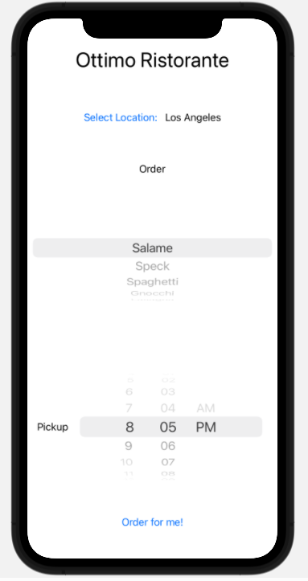

# Restaurant-Picker
This repo based on the codewithchris.com iOS Foundations course 
[Module 4 Lesson 9 Challenge](https://learn.codewithchris.com/courses/take/foundations/texts/21943215-lesson-9-challenge) 
demonstrates a simple app, where you can choose your location, the menu item, and pickup time. You can also have it
choose the order for you.

It only allows you to order on the current day up until the time the Ottimo Ristorante restaurant closes at 10pm.

It needs the Order for me button to also randomly choose the pickup time, but I have not made this work yet.

